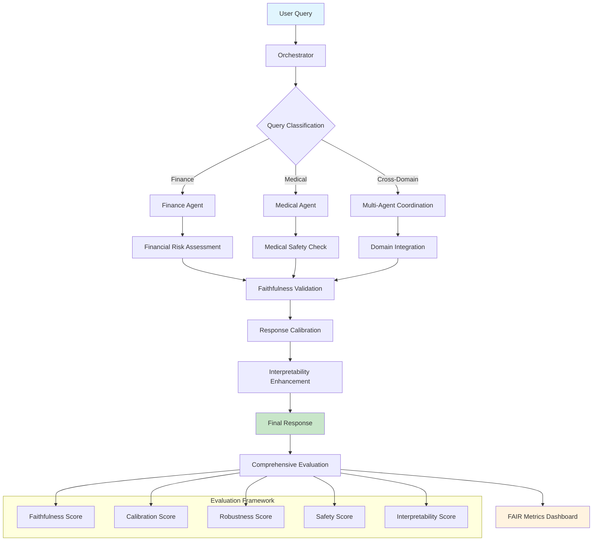

# 🎓 Data Science Master's Capstone Projects Repository

## 📚 Academic Information
- **Program**: Master's in Data Science
- **Semester**: 4th Semester (Final)
- **Institution**: Pace University
- **Student**: Somesh Ghaturle
- **Academic Year**: 2024-2025

## 🎯 Repository Overview

This repository contains the **final capstone project** for the Master's in Data Science program. The capstone represents the culmination of advanced data science studies, demonstrating mastery of cutting-edge AI technologies, machine learning principles, and ethical AI development practices.

## 🏆 Featured Capstone Project: Fair Agent

### Project Title
**"Fair Agent: Faithful, Adaptive, Interpretable, and Risk-Aware Agentic LLMs for Finance and Medicine"**

### 🔬 Project Description

Our capstone project addresses one of the most critical challenges in modern AI: creating Large Language Model (LLM) agents that are not only powerful but also trustworthy, transparent, and safe for real-world applications in high-stakes domains like finance and healthcare.

### 🎯 Project Significance

In the rapidly evolving landscape of AI and machine learning, this project represents:

- **Academic Excellence**: Demonstrates mastery of advanced concepts in AI, NLP, and responsible machine learning
- **Industry Relevance**: Addresses real-world challenges in AI safety and trustworthiness
- **Innovation**: Introduces the FAIR framework for evaluating and improving LLM agent behavior
- **Practical Impact**: Provides tools for building safer AI systems in critical domains

### 🔑 Core Innovation: The FAIR Framework

Our project introduces the **FAIR principles** for AI agents:

#### 🔍 **F**aithful
- **Truthfulness and Reliability**: Ensures agents provide accurate, verifiable information
- **Source Verification**: Tracks and validates information sources
- **Hallucination Detection**: Identifies and mitigates false or fabricated content
- **Evidence Grounding**: Bases responses on solid factual foundations

#### 🔄 **A**daptive  
- **Context Awareness**: Adjusts responses based on user expertise and situation
- **Dynamic Complexity**: Modifies technical depth based on audience
- **Domain Specialization**: Tailors behavior for specific fields (finance, medicine)
- **Personalized Interaction**: Adapts communication style to user needs

#### 📊 **I**nterpretable
- **Transparency**: Provides clear explanations of reasoning processes
- **Confidence Scoring**: Quantifies certainty levels in responses
- **Decision Traceability**: Shows step-by-step logic chains
- **Uncertainty Communication**: Clearly expresses limitations and unknowns

#### 🛡️ **R**isk-Aware
- **Safety Protocols**: Implements domain-specific safety measures
- **Ethical Guidelines**: Ensures responses align with professional standards
- **Harm Prevention**: Detects and prevents potentially dangerous advice
- **Professional Disclaimers**: Includes appropriate legal and safety warnings

## 🏗️ Technical Architecture

### Multi-Agent System Design
```
┌─────────────────┐    ┌─────────────────┐    ┌─────────────────┐
│   Finance Agent │    │  Medical Agent  │    │  Orchestrator   │
│   (Llama-2-7b)  │    │   (BioBERT)     │    │   (Router)      │
│                 │    │                 │    │                 │
│ • Risk Analysis │    │ • Safety Checks │    │ • Query Routing │
│ • Market Data   │    │ • Evidence Val. │    │ • Response Agg. │
│ • Compliance    │    │ • Ethics Proto. │    │ • FAIR Scoring  │
└─────────────────┘    └─────────────────┘    └─────────────────┘
```

### Technology Stack
- **Core Framework**: Python 3.9+
- **ML Libraries**: Transformers, PyTorch, Datasets
- **NLP Tools**: Hugging Face, LangChain
- **Data Processing**: Pandas, NumPy, Scikit-learn
- **Containerization**: Docker, Docker Compose
- **Configuration**: YAML-based config management

### Datasets
- **Financial**: FinQA, TAT-QA (quantitative reasoning)
- **Medical**: MIMIC-IV, PubMedQA (clinical and research data)

## 📁 Project Structure

```
fair_agent_project/
├── 📁 agents/                    # FAIR-enhanced AI agents
│   ├── finance_agent.py         # Financial domain agent
│   ├── medical_agent.py         # Medical domain agent
│   └── orchestrator.py          # Multi-agent coordinator
├── 📁 scripts/                  # Utilities and runners
│   ├── run_pipeline.py          # Main execution pipeline
│   ├── preprocess_data.py       # Data preparation
│   └── evaluate_agents.py       # Performance evaluation
├── 📁 data/                     # Datasets and samples
├── 🐳 Dockerfile               # Container configuration
├── 🐳 docker-compose.yml       # Multi-service setup
├── 📋 requirements.txt         # Python dependencies
├── 📖 # FAIR-Agent: Faithful, Adaptive, Interpretable, and Risk-aware Multi-Agent Framework

  

## Overview

FAIR-Agent is a modular multi-agent framework that integrates **Faithful**, **Adaptive**, **Interpretable**, and **Risk-aware** LLM agents specifically designed for high-stakes domains like finance and medicine. The system ensures reliable, safe, and transparent AI assistance while maintaining domain-specific expertise.

## System Architecture Flowchart



## What We Are Building

### 🎯 Project Objectives

1. **Faithful Agent System**: Develop LLM agents that provide responses grounded in reliable sources and maintain consistency with established knowledge bases
2. **Adaptive Multi-Domain Framework**: Create a system that intelligently routes queries to domain-specific experts while handling cross-domain scenarios
3. **Interpretable AI Responses**: Ensure all agent responses include clear reasoning chains, uncertainty indicators, and source attributions
4. **Risk-Aware Decision Making**: Implement comprehensive safety mechanisms for high-stakes financial and medical advice

### 🏗️ Core Components

#### 1. Agent Architecture
- **Finance Agent**: Specialized for financial queries with numerical reasoning and risk assessment
- **Medical Agent**: Healthcare-focused with strict safety protocols and harm prevention
- **Orchestrator**: Central coordination system for query routing and response integration

#### 2. Evaluation Framework
- **Faithfulness Evaluator**: Measures response accuracy and source alignment
- **Calibration Evaluator**: Assesses confidence calibration and uncertainty quantification
- **Robustness Evaluator**: Tests system resilience against adversarial inputs
- **Safety Evaluator**: Comprehensive safety analysis for sensitive domains
- **Interpretability Evaluator**: Evaluates explanation quality and reasoning clarity

#### 3. Safety and Compliance
- Multi-layered safety keyword filtering
- Domain-specific harm prevention protocols
- Response uncertainty quantification
- Comprehensive audit trails

## Features

### 🔬 Domain Specialization
- **Finance**: Portfolio analysis, investment recommendations, risk assessment, market analysis
- **Medicine**: Symptom analysis, treatment information, drug interactions, medical literature review
- **Cross-Domain**: Healthcare economics, pharmaceutical investments, medical device markets

### 🛡️ Safety First Design
- Real-time harmful content detection
- Medical advice disclaimers and limitations
- Financial risk warnings and disclaimers
- Escalation protocols for high-risk queries

### 📊 Comprehensive Evaluation
- Multi-dimensional FAIR scoring system
- Real-time performance monitoring
- Detailed interpretability analysis
- Robustness testing against adversarial inputs

### 🔍 Transparency and Explainability
- Step-by-step reasoning chains
- Source attribution and evidence linking
- Confidence intervals and uncertainty bounds
- Clear explanation of limitations

## Technical Stack

### Core Dependencies
- **Python 3.7+**: Core programming language
- **Transformers**: Hugging Face model integration
- **PyTorch**: Deep learning backend
- **LangChain**: LLM orchestration and chaining
- **sentence-transformers**: Semantic similarity and embeddings

### Domain-Specific Models
- **Finance**: Llama-2-7b-hf, FinBERT for financial sentiment
- **Medical**: BioGPT-Large, Clinical-BERT for medical understanding
- **General**: GPT-4, Claude for reasoning and explanation

### Evaluation and Monitoring
- **scikit-learn**: Machine learning metrics
- **numpy/pandas**: Data manipulation and analysis
- **matplotlib/seaborn**: Visualization and reporting
- **YAML**: Configuration management

## Quick Start

### Installation

```bash
# Clone the repository
git clone https://github.com/your-org/fair-agent.git
cd fair-agent

# Create virtual environment
python -m venv venv
source venv/bin/activate  # On Windows: venv\Scripts\activate

# Install dependencies
pip install -r requirements.txt

# Download required models
python scripts/download_models.py
```

### Configuration

1. **Update Configuration**: Edit `config/config.yaml` to set your model preferences and API keys
2. **Safety Settings**: Review `config/safety_keywords.yaml` for domain-specific safety filters
3. **Dataset Paths**: Configure paths to your evaluation datasets

### Basic Usage

```python
from src.agents import Orchestrator

# Initialize the system
orchestrator = Orchestrator()

# Process a query
result = orchestrator.process_query(
    "What are the investment risks of pharmaceutical stocks during a pandemic?"
)

print(f"Answer: {result.primary_answer}")
print(f"Confidence: {result.confidence_score}")
print(f"Domain: {result.domain}")
print(f"Safety Score: {result.safety_score}")
```

### Running Evaluations

```bash
# Run comprehensive evaluation
python scripts/evaluate.py --config config/config.yaml --output results/

# Preprocess datasets
python scripts/preprocess_finance_data.py
python scripts/preprocess_medical_data.py

# Run pipeline with custom data
python scripts/run_pipeline.py --input data/test_queries.json
```

## Project Structure

```
fair-agent/
├── README.md                          # This file
├── requirements.txt                   # Python dependencies
├── config/
│   ├── config.yaml                   # Main configuration
│   └── safety_keywords.yaml          # Safety filtering rules
├── src/
│   ├── __init__.py
│   ├── agents/
│   │   ├── __init__.py
│   │   ├── finance_agent.py          # Financial domain specialist
│   │   ├── medical_agent.py          # Medical domain specialist
│   │   └── orchestrator.py           # Central coordination
│   └── evaluation/
│       ├── __init__.py
│       ├── faithfulness.py           # Faithfulness metrics
│       ├── calibration.py            # Confidence calibration
│       ├── robustness.py             # Adversarial robustness
│       ├── safety.py                 # Safety evaluation
│       └── interpretability.py       # Explanation quality
├── scripts/
│   ├── download_models.py            # Model setup
│   ├── preprocess_finance_data.py    # Finance data preparation
│   ├── preprocess_medical_data.py    # Medical data preparation
│   ├── run_pipeline.py               # End-to-end pipeline
│   └── evaluate.py                   # Comprehensive evaluation
├── data/                             # Datasets and test data
├── results/                          # Evaluation outputs
└── tests/                           # Unit and integration tests
```

## Evaluation Metrics

### FAIR Scoring System

| Dimension | Metrics | Weight |
|-----------|---------|---------|
| **Faithfulness** | Token overlap, semantic similarity, factual consistency | 25% |
| **Adaptability** | Cross-domain performance, context adaptation | 25% |
| **Interpretability** | Reasoning clarity, explanation completeness, evidence citation | 25% |
| **Risk-awareness** | Safety compliance, uncertainty quantification, harm prevention | 25% |

### Performance Benchmarks

- **Faithfulness Score**: >0.8 for production readiness
- **Safety Compliance**: 100% for harmful content detection
- **Interpretability**: >0.75 for explanation quality
- **Calibration ECE**: <0.1 for well-calibrated confidence

## Safety and Ethics

### Medical Safety Protocols
- No direct diagnostic advice
- Clear disclaimers about professional consultation
- Harm detection for dangerous self-treatment suggestions
- Escalation for emergency medical situations

### Financial Safety Measures
- Risk warnings for investment advice
- Disclaimers about market volatility
- Detection of pump-and-dump schemes
- Compliance with financial advisory regulations

### General Ethical Guidelines
- Bias detection and mitigation
- Privacy protection for sensitive queries
- Transparent limitation acknowledgment
- Continuous safety monitoring

## Development Roadmap

### Phase 1: Core Framework ✅
- [x] Multi-agent architecture
- [x] Domain-specific agents (Finance, Medical)
- [x] Central orchestration system
- [x] Basic safety mechanisms

### Phase 2: Evaluation System ✅
- [x] FAIR metrics implementation
- [x] Comprehensive evaluation framework
- [x] Performance benchmarking
- [x] Safety compliance testing

### Phase 3: Enhancement & Deployment 🚧
- [ ] Advanced model fine-tuning
- [ ] Real-time performance monitoring
- [ ] API service deployment
- [ ] User interface development

### Phase 4: Production & Scaling 📋
- [ ] Enterprise deployment
- [ ] Continuous learning integration
- [ ] Multi-language support
- [ ] Advanced safety features

## Contributing

We welcome contributions! Please see our [Contributing Guidelines](CONTRIBUTING.md) for details.

### Development Setup
```bash
# Install development dependencies
pip install -r requirements-dev.txt

# Run tests
python -m pytest tests/

# Run type checking
mypy src/

# Run linting
flake8 src/ tests/
```

## Research and Publications

This project is based on cutting-edge research in:
- **Faithful AI**: Grounding responses in reliable sources
- **Multi-Agent Systems**: Coordination and specialization
- **AI Safety**: Harm prevention in high-stakes domains
- **Explainable AI**: Transparent reasoning and decision making

### Key Papers and References
- "Constitutional AI: Harmlessness from AI Feedback" (Anthropic, 2022)
- "Training Language Models to Follow Instructions with Human Feedback" (OpenAI, 2022)
- "LaMDA: Language Models for Dialog Applications" (Google, 2022)
- "Faithful Reasoning Using Large Language Models" (Various, 2023)

## License

This project is licensed under the MIT License - see the [LICENSE](LICENSE) file for details.

## Acknowledgments

- Hugging Face for transformer models and infrastructure
- OpenAI for foundational language model research
- The broader AI safety and alignment research community
- Medical and financial domain experts for safety guidelines

## Contact

For questions, issues, or collaboration opportunities:

- **Project Lead**: [Your Name](mailto:your.email@university.edu)
- **Technical Issues**: [GitHub Issues](https://github.com/your-org/fair-agent/issues)
- **Research Collaboration**: [Research Contact](mailto:research@university.edu)

---

**Disclaimer**: FAIR-Agent is a research project designed for educational and research purposes. It should not be used as a substitute for professional medical advice, diagnosis, or treatment, nor for professional financial advice. Always consult qualified professionals for important decisions in these domains.               # Project documentation
├── 🎯 demo_fair_agent.py      # Live demonstration system
├── 🎮 interactive_demo.py     # Interactive testing interface
└── 📊 project_status_report.py # Comprehensive status report
```

## 🚀 Getting Started

### Quick Start
```bash
# Clone and navigate to project
cd fair_agent_project

# Run FAIR demonstration
python3 demo_fair_agent.py

# Interactive testing
python3 interactive_demo.py

# Project status report
python3 project_status_report.py
```

### Docker Deployment
```bash
# Build and run with Docker
./docker-run.sh

# Or use Docker Compose
docker-compose up --build
```

## 🧪 Demonstration Capabilities

The project includes comprehensive demonstrations showing:

### Real-World Scenarios
1. **Financial Query**: "What are the risks of investing in cryptocurrency?"
   - ✅ Risk assessment and investment warnings
   - ✅ Confidence scoring and faithfulness evaluation
   - ✅ Professional disclaimers and safety protocols

2. **Medical Query**: "What should I know about diabetes management?"
   - ✅ Medical safety checks and evidence validation
   - ✅ Professional consultation recommendations
   - ✅ Ethical guidelines and harm prevention

3. **Technical Query**: "Explain machine learning algorithms"
   - ✅ Expertise level detection and complexity adjustment
   - ✅ Adaptive response formatting
   - ✅ Interpretability and reasoning transparency

## 🏆 Academic Achievement Highlights

### Research Contributions
- **Novel Framework**: Introduction of FAIR principles for LLM evaluation
- **Safety Innovation**: Domain-specific safety protocols for high-risk applications
- **Practical Implementation**: Working system demonstrating theoretical concepts
- **Ethical AI**: Emphasis on responsible AI development and deployment

### Technical Mastery Demonstrated
- **Advanced NLP**: Implementation of state-of-the-art language models
- **Multi-Agent Systems**: Sophisticated orchestration and coordination
- **Safety Engineering**: Risk assessment and mitigation strategies
- **Software Engineering**: Production-ready containerized deployment
- **Evaluation Metrics**: Comprehensive testing and validation frameworks

### Industry Readiness
- **Professional Standards**: Follows industry best practices for AI development
- **Scalable Architecture**: Designed for real-world deployment and scaling
- **Documentation**: Comprehensive technical and user documentation
- **Reproducibility**: Fully containerized and version-controlled implementation

## 📈 Impact and Applications

### Academic Impact
- Contributes to the growing field of trustworthy AI
- Provides framework for evaluating LLM safety and reliability
- Demonstrates practical application of theoretical AI safety concepts

### Industry Applications
- **Healthcare**: Safer medical information systems
- **Finance**: Trustworthy financial advisory tools
- **Education**: Responsible AI tutoring systems
- **Enterprise**: Ethical AI assistants for business applications

## 🎯 Future Work and Extensions

The capstone project provides a foundation for continued research and development:

- **Advanced Models**: Integration with newer LLM architectures
- **Expanded Domains**: Extension to legal, educational, and other critical sectors
- **Real-time Systems**: Development of production-ready deployment pipelines
- **User Studies**: Comprehensive evaluation with real users and domain experts

## 📞 Academic Contact

**Student**: Somesh Ghaturle  
**Program**: Master's in Data Science (4th Semester)  
**Institution**: Pace University  
**GitHub**: [somesh-ghaturle](https://github.com/somesh-ghaturle)  

## 📋 Project Status

**Status**: ✅ **SUCCESSFULLY COMPLETED**  
**Completion Date**: September 2025  
**All FAIR Principles**: ✅ Implemented and Tested  
**Documentation**: ✅ Comprehensive  
**Demonstration**: ✅ Interactive System Ready  
**Deployment**: ✅ Docker-Ready  

---

## 🎓 Capstone Project Certification

This repository represents the successful completion of the final capstone requirement for the Master's in Data Science program. The project demonstrates:

- ✅ **Technical Excellence**: Advanced implementation of cutting-edge AI technologies
- ✅ **Research Innovation**: Novel contribution to the field of trustworthy AI
- ✅ **Practical Application**: Real-world relevance and industry applicability  
- ✅ **Academic Rigor**: Comprehensive documentation and evaluation
- ✅ **Professional Standards**: Production-ready code and deployment practices

**This capstone project marks the culmination of advanced graduate studies in Data Science and represents readiness for professional practice in the field of AI and machine learning.**

---

*© 2025 Somesh Ghaturle - Master's in Data Science Capstone Project - Pace University*