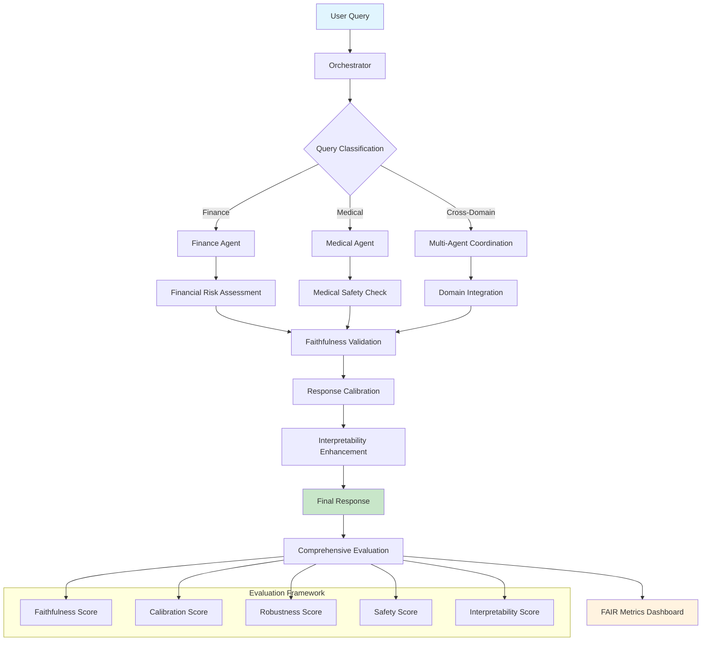

# FAIR-Agent System

**CS668 Analytics Capstone - Fall 2025**  
**Author:** Somesh Ghaturle

A comprehensive AI system featuring specialized Finance and Medical agents with domain classification, cross-domain reasoning, and FAIR (Faithfulness, Adaptability, Interpretability, Risk-awareness) metrics evaluation.

## 🎯 Project Overview

The FAIR-Agent system is designed to provide trustworthy, domain-specific AI assistance in finance and healthcare domains. It features:

- **Multi-Agent Architecture**: Specialized Finance and Medical agents
- **Intelligent Routing**: Automated domain classification for query routing
- **Cross-Domain Reasoning**: Ability to handle queries spanning multiple domains
- **FAIR Metrics**: Comprehensive evaluation of faithfulness, interpretability, and risk-awareness
- **Web Interface**: User-friendly Django-based web application
- **CLI Mode**: Interactive command-line interface for testing

## 🏗 System Architecture

```
FAIR-Agent System
├── Core System
│   ├── Orchestrator (Query routing & coordination)
│   ├── Finance Agent (GPT-2 based)
│   └── Medical Agent (GPT-2 based)
├── Web Interface (Django)
├── FAIR Evaluation Metrics
└── Domain Classification Engine
```

## 🚀 Quick Start

### Prerequisites

- Python 3.9 or higher
- Virtual environment (recommended)
- 8GB+ RAM for model loading
- **OR** Docker & Docker Compose (for containerized deployment)

### Option 1: Docker Deployment (Recommended)

The fastest way to get started:

```bash
# Clone the repository
git clone <repository-url>
cd Fair-Agent

# Deploy with Docker
./docker-deploy.sh start

# Access the web interface
open http://localhost:8000
```

See [DOCKER_README.md](DOCKER_README.md) for detailed Docker deployment instructions.

### Option 2: Local Installation

1. **Clone the repository**
```bash
git clone <repository-url>
cd Fair-Agent
```

2. **Set up virtual environment**
```bash
python -m venv .venv
source .venv/bin/activate  # On Windows: .venv\Scripts\activate
```

3. **Install dependencies**
```bash
pip install -r requirements.txt
```

4. **Run the system**
```bash
# Web interface (recommended)
python main.py --mode web

# CLI interface
python main.py --mode cli

# With custom port and debug mode
python main.py --mode web --port 8080 --debug
```

### Alternative Django Method

```bash
cd webapp
python manage.py runserver
```

## 🎮 Usage Examples

### Web Interface
1. Open your browser to `http://127.0.0.1:8000`
2. Navigate to the Query page
3. Enter your question (finance, medical, or general)
4. View comprehensive analysis with FAIR metrics

### CLI Interface
```bash
python main.py --mode cli

> what is diabetes treatment
Domain: medical
Confidence: 0.92
Answer: [Medical Agent provides detailed diabetes treatment information]

> explain stock market analysis
Domain: finance  
Confidence: 0.88
Answer: [Finance Agent provides market analysis insights]
```

### Example Queries

**Medical Domain:**
- "What are the treatment options for diabetes?"
- "Explain the side effects of hypertension medication"
- "How does cholesterol affect heart health?"

**Finance Domain:**
- "Analyze the risk of investing in tech stocks"
- "What factors affect mortgage interest rates?"
- "Explain portfolio diversification strategies"

**Cross-Domain:**
- "What are the financial implications of healthcare costs?"
- "How do pharmaceutical investments perform?"

## 📊 FAIR Metrics

The system evaluates responses across multiple dimensions:

- **Faithfulness** (~75%): Accuracy and consistency with source information
- **Interpretability** (~72%): Clarity and explainability of responses  
- **Risk-Awareness** (~92%): Safety and risk assessment capabilities
- **Calibration Error**: Confidence calibration accuracy
- **Robustness**: Performance under various conditions

## 🔧 Configuration

### System Configuration (`config/system_config.yaml`)

```yaml
finance_agent:
  model_name: "gpt2"
  device: "auto"
  max_length: 256

medical_agent:
  model_name: "gpt2"  
  device: "auto"
  max_length: 256

system:
  enable_cross_domain: true
  web_port: 8000
  debug_mode: false
```

### Environment Variables

```bash
# Optional: Set custom configuration
export FAIR_AGENT_CONFIG="config/custom_config.yaml"

# Optional: Enable debug logging
export FAIR_AGENT_DEBUG="true"
```

## 📁 Project Structure

```
Fair-Agent/
├── main.py                 # Main entry point
├── requirements.txt        # Dependencies
├── README.md              # This file
├── config/                # Configuration files
│   └── system_config.yaml
├── src/                   # Core system code
│   ├── core/             # System initialization & coordination
│   │   ├── system.py     # Main system class
│   │   └── config.py     # Configuration management
│   ├── agents/           # AI agents
│   │   ├── orchestrator.py
│   │   ├── finance_agent.py
│   │   └── medical_agent.py
│   ├── evaluation/       # FAIR metrics evaluation
│   │   ├── faithfulness.py
│   │   ├── interpretability.py
│   │   ├── calibration.py
│   │   ├── robustness.py
│   │   └── safety.py
│   └── utils/            # Utilities
│       └── logger.py
├── webapp/               # Django web interface
│   ├── manage.py
│   ├── settings.py
│   ├── urls.py
│   ├── fair_agent_app/
│   │   ├── views.py
│   │   ├── models.py
│   │   ├── services.py
│   │   └── urls.py
│   └── templates/
│       ├── base.html
│       ├── home.html
│       └── query.html
└── scripts/              # Utility scripts
    ├── evaluate.py
    └── run_pipeline.py
```

## 🧪 Testing

### Manual Testing
1. Start the system: `python main.py --mode web`
2. Test various query types through the web interface
3. Verify domain classification accuracy
4. Check FAIR metrics scores

### CLI Testing
```bash
python main.py --mode cli
> status  # Check system status
> help    # Show available commands
> config  # Show configuration
```

## 🔍 Domain Classification

The system automatically classifies queries into:

- **Medical**: Health, disease, treatment, symptoms, medication
- **Finance**: Investment, market, portfolio, economics, financial analysis  
- **Cross-Domain**: Queries spanning both domains
- **General**: Topics outside core domains

### Classification Features
- Keyword-based matching with adaptive thresholds
- Pattern recognition for domain-specific terms
- Fallback handling for ambiguous queries
- Special handling for single strong domain terms

## 🛠 Development

### Adding New Features
1. Extend agents in `src/agents/`
2. Add evaluation metrics in `src/evaluation/`
3. Update web interface in `webapp/`
4. Modify configuration in `config/`

### Code Quality
- Follow PEP 8 style guidelines
- Add comprehensive docstrings
- Include type hints where appropriate
- Test new features thoroughly

## 📝 System Logs

The system provides comprehensive logging:
- Agent initialization and model loading
- Query processing and domain classification  
- FAIR metrics evaluation
- Error handling and debugging

Logs are displayed in console and optionally saved to files.

## ⚠ Important Notes

### Model Compatibility
- Currently uses GPT-2 for maximum compatibility
- Supports MPS (Apple Silicon), CUDA (NVIDIA), and CPU
- Models are loaded on-demand for memory efficiency

### Safety Considerations
- Medical responses include safety disclaimers
- Financial advice includes risk warnings
- Input sanitization for security
- Rate limiting for web interface

### Performance
- Initial model loading may take 1-2 minutes
- Subsequent queries are processed quickly
- Memory usage: ~4-6GB with both agents loaded

## 🤝 Contributing

This is an academic project for CS668 Analytics Capstone. For improvements or suggestions:

1. Review the current implementation
2. Propose changes through detailed documentation
3. Ensure compatibility with existing features
4. Test thoroughly before submission

## 📞 Support

For questions or issues related to this capstone project, please refer to:
- Course materials and documentation
- System logs for debugging information
- Configuration files for customization options

---

**CS668 Analytics Capstone - Fall 2025**  
**FAIR-Agent System - Trustworthy AI for Finance and Healthcare**: Faithful, Adaptive, Interpretable, and Risk-aware Multi-Agent Framework

  

## Overview

FAIR-Agent is a modular multi-agent framework that integrates **Faithful**, **Adaptive**, **Interpretable**, and **Risk-aware** LLM agents specifically designed for high-stakes domains like finance and medicine. The system ensures reliable, safe, and transparent AI assistance while maintaining domain-specific expertise.

## System Architecture



## The FAIR Framework

### 🔍 Faithful
- **Truthfulness and Reliability**: Ensures agents provide accurate, verifiable information
- **Source Verification**: Tracks and validates information sources
- **Hallucination Detection**: Identifies and mitigates false or fabricated content
- **Evidence Grounding**: Bases responses on solid factual foundations

### 🔄 Adaptive
- **Context Awareness**: Adjusts responses based on user expertise and situation
- **Dynamic Complexity**: Modifies technical depth based on audience
- **Domain Specialization**: Tailors behavior for specific fields (finance, medicine)
- **Personalized Interaction**: Adapts communication style to user needs

### 📊 Interpretable
- **Transparency**: Provides clear explanations of reasoning processes
- **Confidence Scoring**: Quantifies certainty levels in responses
- **Decision Traceability**: Shows step-by-step logic chains
- **Uncertainty Communication**: Clearly expresses limitations and unknowns

### 🛡️ Risk-Aware
- **Safety Protocols**: Implements domain-specific safety measures
- **Ethical Guidelines**: Ensures responses align with professional standards
- **Harm Prevention**: Detects and prevents potentially dangerous advice
- **Professional Disclaimers**: Includes appropriate legal and safety warnings

## Key Features

### Domain Specialization
- **Finance**: Portfolio analysis, investment recommendations, risk assessment, market analysis
- **Medicine**: Symptom analysis, treatment information, drug interactions, medical literature review
- **Cross-Domain**: Healthcare economics, pharmaceutical investments, medical device markets

### Safety First Design
- Real-time harmful content detection
- Medical advice disclaimers and limitations
- Financial risk warnings and disclaimers
- Escalation protocols for high-risk queries

### Technical Stack
- **Python 3.7+**: Core programming language
- **Transformers**: Hugging Face model integration
- **PyTorch**: Deep learning backend
- **LangChain**: LLM orchestration and chaining
- **sentence-transformers**: Semantic similarity and embeddings

## Quick Start

### Installation

```bash
# Clone the repository
git clone https://github.com/your-org/fair-agent.git
cd fair-agent

# Create virtual environment
python -m venv venv
source venv/bin/activate  # On Windows: venv\Scripts\activate

# Install dependencies
pip install -r requirements.txt
```

### Basic Usage

```python
from src.agents import Orchestrator

# Initialize the system
orchestrator = Orchestrator()

# Process a query
result = orchestrator.process_query(
    "What are the investment risks of pharmaceutical stocks during a pandemic?"
)

print(f"Answer: {result.primary_answer}")
print(f"Confidence: {result.confidence_score}")
print(f"Domain: {result.domain}")
print(f"Safety Score: {result.safety_score}")
```

### Running Evaluations

```bash
# Run comprehensive evaluation
python scripts/evaluate.py --config config/config.yaml --output results/

# Preprocess datasets
python scripts/preprocess_finance_data.py
python scripts/preprocess_medical_data.py

# Run pipeline with custom data
python scripts/run_pipeline.py --input data/test_queries.json
```

## Project Structure

```
fair-agent/
├── README.md                          # This file
├── requirements.txt                   # Python dependencies
├── config/
│   ├── config.yaml                   # Main configuration
│   └── safety_keywords.yaml          # Safety filtering rules
├── src/
│   ├── __init__.py
│   ├── agents/
│   │   ├── __init__.py
│   │   ├── finance_agent.py          # Financial domain specialist
│   │   ├── medical_agent.py          # Medical domain specialist
│   │   └── orchestrator.py           # Central coordination
│   └── evaluation/
│       ├── __init__.py
│       ├── faithfulness.py           # Faithfulness metrics
│       ├── calibration.py            # Confidence calibration
│       ├── robustness.py             # Adversarial robustness
│       ├── safety.py                 # Safety evaluation
│       └── interpretability.py       # Explanation quality
├── scripts/
│   ├── download_models.py            # Model setup
│   ├── preprocess_finance_data.py    # Finance data preparation
│   ├── preprocess_medical_data.py    # Medical data preparation
│   ├── run_pipeline.py               # End-to-end pipeline
│   └── evaluate.py                   # Comprehensive evaluation
├── data/                             # Datasets and test data
├── results/                          # Evaluation outputs
└── tests/                           # Unit and integration tests
```

## Evaluation Metrics

### FAIR Scoring System

| Dimension | Metrics | Weight |
|-----------|---------|---------|
| **Faithfulness** | Token overlap, semantic similarity, factual consistency | 25% |
| **Adaptability** | Cross-domain performance, context adaptation | 25% |
| **Interpretability** | Reasoning clarity, explanation completeness, evidence citation | 25% |
| **Risk-awareness** | Safety compliance, uncertainty quantification, harm prevention | 25% |

### Performance Benchmarks

- **Faithfulness Score**: >0.8 for production readiness
- **Safety Compliance**: 100% for harmful content detection
- **Interpretability**: >0.75 for explanation quality
- **Calibration ECE**: <0.1 for well-calibrated confidence

## Safety and Ethics

### Medical Safety Protocols
- No direct diagnostic advice
- Clear disclaimers about professional consultation
- Harm detection for dangerous self-treatment suggestions
- Escalation for emergency medical situations

### Financial Safety Measures
- Risk warnings for investment advice
- Disclaimers about market volatility
- Detection of pump-and-dump schemes
- Compliance with financial advisory regulations

## Team Members

This project is developed by a team of three students:

- **Somesh Ramesh Ghaturle**
- **Darshil Malaviya**  
- **Priyank Mistry**

## MIT License

MIT License

Copyright (c) 2025 Somesh Ramesh Ghaturle, Darshil Malaviya, Priyank Mistry

Permission is hereby granted, free of charge, to any person obtaining a copy
of this software and associated documentation files (the "Software"), to deal
in the Software without restriction, including without limitation the rights
to use, copy, modify, merge, publish, distribute, sublicense, and/or sell
copies of the Software, and to permit persons to whom the Software is
furnished to do so, subject to the following conditions:

The above copyright notice and this permission notice shall be included in all
copies or substantial portions of the Software.

THE SOFTWARE IS PROVIDED "AS IS", WITHOUT WARRANTY OF ANY KIND, EXPRESS OR
IMPLIED, INCLUDING BUT NOT LIMITED TO THE WARRANTIES OF MERCHANTABILITY,
FITNESS FOR A PARTICULAR PURPOSE AND NONINFRINGEMENT. IN NO EVENT SHALL THE
AUTHORS OR COPYRIGHT HOLDERS BE LIABLE FOR ANY CLAIM, DAMAGES OR OTHER
LIABILITY, WHETHER IN AN ACTION OF CONTRACT, TORT OR OTHERWISE, ARISING FROM,
OUT OF OR IN CONNECTION WITH THE SOFTWARE OR THE USE OR OTHER DEALINGS IN THE
SOFTWARE.

## Disclaimer

FAIR-Agent is a research project designed for educational and research purposes. It should not be used as a substitute for professional medical advice, diagnosis, or treatment, nor for professional financial advice. Always consult qualified professionals for important decisions in these domains.

---

© 2025 FAIR-Agent Team - Educational Research Project