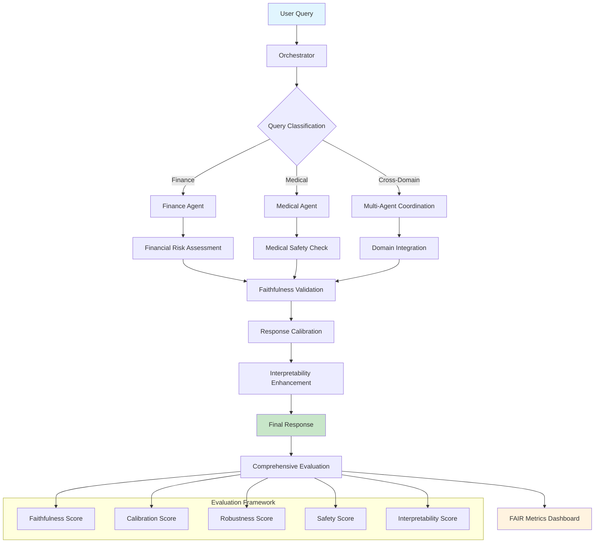

# FAIR-Agent: Faithful, Adaptive, Interpretable, and Risk-aware Multi-Agent Framework

  

## Overview

FAIR-Agent is a modular multi-agent framework that integrates **Faithful**, **Adaptive**, **Interpretable**, and **Risk-aware** LLM agents specifically designed for high-stakes domains like finance and medicine. The system ensures reliable, safe, and transparent AI assistance while maintaining domain-specific expertise.

## System Architecture Flowchart



## The FAIR Framework

### 🔍 **F**aithful

- **Truthfulness and Reliability**: Ensures agents provide accurate, verifiable information
- **Source Verification**: Tracks and validates information sources
- **Hallucination Detection**: Identifies and mitigates false or fabricated content
- **Evidence Grounding**: Bases responses on solid factual foundations

### 🔄 **A**daptive

- **Context Awareness**: Adjusts responses based on user expertise and situation
- **Dynamic Complexity**: Modifies technical depth based on audience
- **Domain Specialization**: Tailors behavior for specific fields (finance, medicine)
- **Personalized Interaction**: Adapts communication style to user needs

### 📊 **I**nterpretable

- **Transparency**: Provides clear explanations of reasoning processes
- **Confidence Scoring**: Quantifies certainty levels in responses
- **Decision Traceability**: Shows step-by-step logic chains
- **Uncertainty Communication**: Clearly expresses limitations and unknowns

### 🛡️ **R**isk-Aware

- **Safety Protocols**: Implements domain-specific safety measures
- **Ethical Guidelines**: Ensures responses align with professional standards
- **Harm Prevention**: Detects and prevents potentially dangerous advice
- **Professional Disclaimers**: Includes appropriate legal and safety warnings

## 🏗️ Technical Architecture

### Multi-Agent System Design
```
┌─────────────────┐    ┌─────────────────┐    ┌─────────────────┐
│   Finance Agent │    │  Medical Agent  │    │  Orchestrator   │
│   (Llama-2-7b)  │    │   (BioBERT)     │    │   (Router)      │
│                 │    │                 │    │                 │
│ • Risk Analysis │    │ • Safety Checks │    │ • Query Routing │
│ • Market Data   │    │ • Evidence Val. │    │ • Response Agg. │
│ • Compliance    │    │ • Ethics Proto. │    │ • FAIR Scoring  │
└─────────────────┘    └─────────────────┘    └─────────────────┘
```

### Technology Stack
- **Core Framework**: Python 3.9+
- **ML Libraries**: Transformers, PyTorch, Datasets
- **NLP Tools**: Hugging Face, LangChain
- **Data Processing**: Pandas, NumPy, Scikit-learn
- **Containerization**: Docker, Docker Compose
- **Configuration**: YAML-based config management

### Datasets
- **Financial**: FinQA, TAT-QA (quantitative reasoning)
- **Medical**: MIMIC-IV, PubMedQA (clinical and research data)

## Quick Start

### Installation

```bash
# Clone the repository
git clone https://github.com/your-org/fair-agent.git
cd fair-agent

# Create virtual environment
python -m venv venv
source venv/bin/activate  # On Windows: venv\Scripts\activate

# Install dependencies
pip install -r requirements.txt

# Download required models
python scripts/download_models.py
```

### Basic Usage

```python
from src.agents import Orchestrator

# Initialize the system
orchestrator = Orchestrator()

# Process a query
result = orchestrator.process_query(
    "What are the investment risks of pharmaceutical stocks during a pandemic?"
)

print(f"Answer: {result.primary_answer}")
print(f"Confidence: {result.confidence_score}")
print(f"Domain: {result.domain}")
print(f"Safety Score: {result.safety_score}")
```

## Project Structure

```
fair-agent/
├── README.md                          # This file
├── requirements.txt                   # Python dependencies
├── config/
│   ├── config.yaml                   # Main configuration
│   └── safety_keywords.yaml          # Safety filtering rules
├── src/
│   ├── __init__.py
│   ├── agents/
│   │   ├── __init__.py
│   │   ├── finance_agent.py          # Financial domain specialist
│   │   ├── medical_agent.py          # Medical domain specialist
│   │   └── orchestrator.py           # Central coordination
│   └── evaluation/
│       ├── __init__.py
│       ├── faithfulness.py           # Faithfulness metrics
│       ├── calibration.py            # Confidence calibration
│       ├── robustness.py             # Adversarial robustness
│       ├── safety.py                 # Safety evaluation
│       └── interpretability.py       # Explanation quality
├── scripts/
│   ├── download_models.py            # Model setup
│   ├── preprocess_finance_data.py    # Finance data preparation
│   ├── preprocess_medical_data.py    # Medical data preparation
│   ├── run_pipeline.py               # End-to-end pipeline
│   └── evaluate.py                   # Comprehensive evaluation
├── data/                             # Datasets and test data
├── results/                          # Evaluation outputs
└── tests/                           # Unit and integration tests
```               # Project documentation
├── 🎯 demo_fair_agent.py      # Live demonstration system
├── 🎮 interactive_demo.py     # Interactive testing interface
└── 📊 project_status_report.py # Comprehensive status report
```

## 🚀 Getting Started

### Quick Start
```bash
# Clone and navigate to project
cd fair_agent_project

# Run FAIR demonstration
python3 demo_fair_agent.py

# Interactive testing
python3 interactive_demo.py

# Project status report
python3 project_status_report.py
```

### Docker Deployment
```bash
# Build and run with Docker
./docker-run.sh

# Or use Docker Compose
docker-compose up --build
```

## 🧪 Demonstration Capabilities

The project includes comprehensive demonstrations showing:

### Real-World Scenarios
1. **Financial Query**: "What are the risks of investing in cryptocurrency?"
   - ✅ Risk assessment and investment warnings
   - ✅ Confidence scoring and faithfulness evaluation
   - ✅ Professional disclaimers and safety protocols

2. **Medical Query**: "What should I know about diabetes management?"
   - ✅ Medical safety checks and evidence validation
   - ✅ Professional consultation recommendations
   - ✅ Ethical guidelines and harm prevention

3. **Technical Query**: "Explain machine learning algorithms"
   - ✅ Expertise level detection and complexity adjustment
   - ✅ Adaptive response formatting
   - ✅ Interpretability and reasoning transparency

## 🏆 Academic Achievement Highlights

### Research Contributions
- **Novel Framework**: Introduction of FAIR principles for LLM evaluation

## Team Members

This project is developed by a team of three students:

- **Somesh Ramesh Ghaturle**
- **Darshil Malaviya**  
- **Priyank Mistry**

## MIT License

MIT License

Copyright (c) 2025 Somesh Ramesh Ghaturle, Darshil Malaviya, Priyank Mistry

Permission is hereby granted, free of charge, to any person obtaining a copy
of this software and associated documentation files (the "Software"), to deal
in the Software without restriction, including without limitation the rights
to use, copy, modify, merge, publish, distribute, sublicense, and/or sell
copies of the Software, and to permit persons to whom the Software is
furnished to do so, subject to the following conditions:

The above copyright notice and this permission notice shall be included in all
copies or substantial portions of the Software.

THE SOFTWARE IS PROVIDED "AS IS", WITHOUT WARRANTY OF ANY KIND, EXPRESS OR
IMPLIED, INCLUDING BUT NOT LIMITED TO THE WARRANTIES OF MERCHANTABILITY,
FITNESS FOR A PARTICULAR PURPOSE AND NONINFRINGEMENT. IN NO EVENT SHALL THE
AUTHORS OR COPYRIGHT HOLDERS BE LIABLE FOR ANY CLAIM, DAMAGES OR OTHER
LIABILITY, WHETHER IN AN ACTION OF CONTRACT, TORT OR OTHERWISE, ARISING FROM,
OUT OF OR IN CONNECTION WITH THE SOFTWARE OR THE USE OR OTHER DEALINGS IN THE
SOFTWARE.

## Disclaimer

FAIR-Agent is a research project designed for educational and research purposes. It should not be used as a substitute for professional medical advice, diagnosis, or treatment, nor for professional financial advice. Always consult qualified professionals for important decisions in these domains.

---

© 2025 FAIR-Agent Team - Educational Research Project