# FAIR-Agent System - Technical Flowchart

**CS668 Analytics Capstone - Fall 2025**  
**Team**: Somesh Ghaturle, Darshil Malaviya, Priyank Mistry  
**Document**: Complete Technical Architecture & Data Flow

---

## 🔄 **System Overview Flowchart**

```mermaid
graph TB
    A[👤 User Input] --> B[🌐 Web Interface<br/>Django Frontend]
    A --> C[💻 CLI Interface<br/>Command Line]
    
    B --> D[📡 API Gateway<br/>Django REST API]
    C --> D
    
    D --> E[🎯 Orchestrator<br/>Central Coordinator]
    
    E --> F{🔍 Domain Classifier<br/>Query Analysis}
    
    F -->|Medical Keywords| G[🏥 Medical Agent<br/>GPT-2 Medical]
    F -->|Finance Keywords| H[💰 Finance Agent<br/>GPT-2 Finance]
    F -->|Cross-Domain| I[🔄 Multi-Agent<br/>Coordination]
    F -->|General| J[📝 General Handler<br/>Domain Guidance]
    
    G --> K[🛡️ Medical Safety<br/>Disclaimer System]
    H --> L[⚠️ Financial Safety<br/>Risk Warnings]
    I --> M[🤝 Cross-Domain<br/>Integration]
    J --> N[ℹ️ Domain Redirect<br/>Guidance Response]
    
    K --> O[📚 Evidence Citation<br/>Medical Sources]
    L --> P[📊 Evidence Citation<br/>Financial Sources]
    M --> Q[🔗 Multi-Source<br/>Evidence]
    
    O --> R[🧠 Chain-of-Thought<br/>Medical Reasoning]
    P --> S[🧠 Chain-of-Thought<br/>Financial Reasoning]
    Q --> T[🧠 Chain-of-Thought<br/>Integrated Reasoning]
    
    R --> U[📈 FAIR Metrics<br/>Evaluation]
    S --> U
    T --> U
    N --> U
    
    U --> V[📊 Response Assembly<br/>With Metrics]
    V --> W[📤 Final Response<br/>To User]
    
    style A fill:#e3f2fd
    style W fill:#c8e6c9
    style E fill:#fff3e0
    style U fill:#fce4ec
```



---

## 🏗️ **Detailed Component Architecture**

### 1. **Entry Points & User Interface**


### 2. **Core Processing Pipeline**


---

## 🔧 **Enhancement Systems Architecture**

### 3. **Safety & Disclaimer System**

```mermaid
graph TB
    A[Response Generated] --> B{Domain Detection}
    
    B -->|Medical| C[Medical Safety Check<br/>src/enhancement/safety/]
    B -->|Finance| D[Financial Safety Check<br/>src/enhancement/safety/]
    B -->|General| E[General Safety Check]
    
    C --> F[Medical Disclaimer<br/>⚠️ Medical Disclaimer Template]
    D --> G[Financial Disclaimer<br/>💰 Financial Risk Warning]
    E --> H[Basic Safety Check]
    
    F --> I[Severity Assessment<br/>Low/Medium/High]
    G --> J[Risk Assessment<br/>Investment Warnings]
    H --> K[Content Safety]
    
    I --> L[Disclaimer Selection<br/>Template Based]
    J --> L
    K --> L
    
    L --> M[Disclaimer Integration<br/>Into Response]
    
    style C fill:#ffebee
    style D fill:#fff3e0
    style M fill:#e8f5e8
```



### 4. **Evidence Citation System**


### 5. **Chain-of-Thought Reasoning**


---

## 📊 **FAIR Metrics Evaluation Pipeline**

### 6. **Comprehensive Evaluation System**


---

## 🗄️ **Data Flow & Storage Architecture**

### 7. **Database & Persistence Layer**


### 8. **Model Loading & Management**


---

## 🐳 **Deployment Architecture**

### 9. **Docker Containerization**


### 10. **API Endpoints & Routes**


---

## 🔧 **Enhancement Integration Flow**

### 11. **Complete Enhancement Pipeline**


---

## 📝 **File Structure & Code Organization**

### 12. **Complete Codebase Map**

```text
FAIR-Agent/
├── 🏠 main.py                          # System Entry Point
├── 🐳 docker-compose.yml               # Container Orchestration
├── 📋 requirements.txt                 # Python Dependencies
├── 📚 README.md                        # Project Documentation
├── 🔧 TECHNICAL_FLOWCHART.md          # This Document
│
├── 📁 config/                          # Configuration Management
│   ├── system_config.yaml             # Main System Config
│   └── safety_keywords.yaml           # Safety Filter Rules
│
├── 📁 src/                             # Core System Code
│   ├── 🔧 core/                        # System Foundation
│   │   ├── system.py                  # Main System Class
│   │   └── config.py                  # Configuration Loader
│   │
│   ├── 🤖 agents/                      # AI Agent Components
│   │   ├── orchestrator.py            # Central Coordinator
│   │   ├── finance_agent.py           # Finance Specialist
│   │   └── medical_agent.py           # Medical Specialist
│   │
│   ├── 📊 evaluation/                  # FAIR Metrics System
│   │   ├── faithfulness.py            # Accuracy Evaluation
│   │   ├── interpretability.py        # Clarity Assessment
│   │   ├── safety.py                  # Safety Evaluation
│   │   ├── calibration.py             # Confidence Calibration
│   │   └── robustness.py              # Robustness Testing
│   │
│   ├── 🛠️ enhancement/                 # System Enhancements
│   │   ├── 🔧 fine_tuning/            # Model Fine-Tuning
│   │   │   └── manager.py             # Training Manager
│   │   ├── 🛡️ safety/                 # Safety Systems
│   │   │   └── disclaimer_system.py   # Disclaimer Generator
│   │   ├── 📚 retrieval/              # Evidence Systems
│   │   │   └── rag_enhancer.py        # Citation System
│   │   └── 🧠 reasoning/              # Reasoning Systems
│   │       └── cot_system.py          # Chain-of-Thought
│   │
│   └── 🔧 utils/                       # Utility Functions
│       └── logger.py                  # Logging System
│
├── 📁 webapp/                          # Django Web Interface
│   ├── manage.py                      # Django Management
│   ├── settings.py                    # Django Settings
│   ├── urls.py                        # URL Routing
│   │
│   ├── 📁 fair_agent_app/             # Main Django App
│   │   ├── views.py                   # Request Handlers
│   │   ├── models.py                  # Database Models
│   │   ├── services.py                # Business Logic
│   │   └── urls.py                    # App URL Patterns
│   │
│   └── 📁 templates/                  # HTML Templates
│       ├── base.html                  # Base Template
│       ├── home.html                  # Landing Page
│       ├── query.html                 # Query Interface
│       └── results.html               # Results Display
│
├── 📁 data/                           # Data Storage
│   └── models/                       # Model Cache
│
└── 📁 logs/                          # System Logs
    └── system.log                    # Application Logs
```

---

## 🚀 **Startup Sequence & Initialization**

### 13. **System Startup Flow**

```mermaid
graph TB
    A[System Start<br/>main.py] --> B[Argument Parsing<br/>CLI/Web Mode]
    
    B --> C[Configuration Loading<br/>config/system_config.yaml]
    
    C --> D[Logging Setup<br/>utils/logger.py]
    
    D --> E[Core System Init<br/>src/core/system.py]
    
    E --> F[Agent Loading<br/>orchestrator.py]
    
    F --> G[Model Loading<br/>GPT-2 Finance & Medical]
    
    G --> H[Enhancement Systems<br/>Safety, Evidence, Reasoning]
    
    H --> I[Database Setup<br/>Django Migrations]
    
    I --> J[Web Server Start<br/>Django Dev Server]
    
    J --> K[Health Check<br/>System Ready]
    
    K --> L[📍 System Running<br/>Port 8000 Active]
    
    style A fill:#e1f5fe
    style L fill:#c8e6c9
    
    M[⏱️ Timing Info:<br/>- Config Load: ~1s<br/>- Model Load: ~30s<br/>- Total Startup: ~45s] 
    
    K --> M
```



---

## 🔍 **Query Processing Detailed Flow**

### 14. **End-to-End Query Processing**

```mermaid
graph TB
    A[👤 User Query:<br/>What are symptoms of diabetes?] --> B[🌐 Web Interface<br/>Form Submission]
    
    B --> C[📡 API Endpoint<br/>/api/query/process/]
    
    C --> D[🔍 Input Validation<br/>- Sanitization<br/>- Length Check<br/>- Content Filter]
    
    D --> E[🎯 Domain Classification<br/>Keywords: diabetes, symptoms<br/>Result: MEDICAL]
    
    E --> F[🏥 Medical Agent<br/>GPT-2 Medical Model]
    
    F --> G[🤖 Model Inference<br/>Response Generation<br/>~10 seconds]
    
    G --> H[🛡️ Safety Enhancement<br/>Medical Disclaimer Added]
    
    H --> I[📚 Evidence Enhancement<br/>Medical Citations Added<br/>Diabetes Guidelines<br/>Medical Research]
    
    I --> J[🧠 Reasoning Enhancement<br/>6-Step Medical Analysis<br/>Step 1: Symptom Analysis<br/>Step 2: Common Causes<br/>...etc]
    
    J --> K[📊 FAIR Evaluation<br/>- Faithfulness: 0.26<br/>- Interpretability: 0.53<br/>- Safety: 0.56<br/>- Calibration: 0.70<br/>- Robustness: 0.23]
    
    K --> L[💾 Database Storage<br/>QueryRecord Saved<br/>ID: 123, Timestamp, Metrics]
    
    L --> M[📤 JSON Response<br/>Contains answer,<br/>fair_metrics,<br/>confidence data]
    
    M --> N[🌐 Frontend Display<br/>Results Page with<br/>Metrics Dashboard]
    
    style A fill:#e1f5fe
    style N fill:#c8e6c9
    style K fill:#fce4ec
```



---

## 💡 **Team Development Guidelines**

### 15. **Development Workflow for Team**

```mermaid
graph TB
    A[🔄 Development Task] --> B{Task Category}
    
    B -->|New Agent| C[📁 src/agents/<br/>Create new agent class<br/>Follow pattern of existing agents]
    
    B -->|New Metric| D[📁 src/evaluation/<br/>Create evaluator class<br/>Implement evaluate method]
    
    B -->|Enhancement| E[📁 src/enhancement/<br/>Create enhancement module<br/>Follow existing patterns]
    
    B -->|Web Feature| F[📁 webapp/<br/>Update views, templates, models<br/>Django patterns]
    
    C --> G[🧪 Testing<br/>- Unit tests<br/>- Integration tests<br/>- Manual testing]
    
    D --> G
    E --> G
    F --> G
    
    G --> H[📚 Documentation<br/>- Update this flowchart<br/>- Update README<br/>- Add docstrings]
    
    H --> I[🔧 Configuration<br/>- Update config files<br/>- Environment variables<br/>- Docker if needed]
    
    I --> J[🚀 Deployment<br/>- Docker rebuild<br/>- System restart<br/>- Verification]
    
    J --> K[✅ Task Complete<br/>Ready for review]
    
    style A fill:#e1f5fe
    style K fill:#c8e6c9
```



---

## 🏁 **Summary & Key Points**

### **🎯 For Team Members:**

1. **Start Here**: Always check this flowchart before making changes
2. **Follow Patterns**: Use existing code patterns for consistency
3. **Test Everything**: Each component has specific testing requirements
4. **Update Documentation**: Keep this flowchart and README current
5. **Docker First**: Use Docker for development and testing

### **🔧 Key System Components:**

- **Orchestrator**: Central coordinator (`src/agents/orchestrator.py`)
- **Agents**: Specialized AI models (`src/agents/`)
- **Enhancements**: Safety, Evidence, Reasoning (`src/enhancement/`)
- **Evaluation**: FAIR metrics system (`src/evaluation/`)
- **Web Interface**: Django application (`webapp/`)

### **📊 Current System Status:**

- ✅ **Recalibrated FAIR Metrics**: Realistic GPT-2 performance (25-76%)
- ✅ **Safety System**: Medical/Financial disclaimers working
- ✅ **Evidence Citations**: Automatic source citation \[1\]\[2\]\[3\]
- ✅ **Chain-of-Thought**: 6-step reasoning process
- ✅ **Docker Deployment**: Containerized system ready
- ✅ **Web Interface**: Full Django application at port 8000

### **🚀 Next Development Areas:**

1. **Fine-Tuning Pipeline**: Complete model training system
2. **Advanced Metrics**: Additional evaluation dimensions  
3. **UI/UX Enhancement**: Better web interface design
4. **Performance Optimization**: Speed and memory improvements
5. **Testing Framework**: Comprehensive test suite

---

## 📚 **Ethical Foundations & Research Citations**

### **Core Research Papers Informing FAIR-Agent Design**

The FAIR-Agent system is built upon rigorous ethical and methodological foundations drawn from leading research in AI ethics, medical statistics, and data science accountability. The following citations directly inform our system architecture and evaluation frameworks:

#### **1. Ethics in Medical Trials: Where Does Statistics Fit In? (Andrew Gelman)**

**Key Insights for FAIR-Agent:**
- **Faithfulness Priority**: Just as trial physicians faced incentives to suppress negative outcomes, AI systems can produce hallucinations that obscure risks. Our system prioritizes faithfulness through reliable evidence grounding and risk-awareness by flagging uncertainty.
- **Evaluation Metric Alignment**: The debate over progression-free survival (PFS) versus overall survival (OS) highlights the importance of choosing evaluation metrics that capture real-world utility rather than narrow statistical endpoints.
- **Transparency Requirements**: Gelman's call for data archiving aligns with our reproducible pipeline development for benchmarking against FinQA, TAT-QA, MIMIC-IV, and PubMedQA datasets.

**Implementation in FAIR-Agent:**
- Enhanced safety disclaimer system preventing misleading medical advice
- Evidence-based response grounding with source citations
- Realistic FAIR metrics reflecting actual model capabilities vs. inflated benchmarks

#### **2. Data Rights and Wrongs (Robert Langkjær-Bain)**

**Key Insights for FAIR-Agent:**
- **Interpretability Culture**: Establishes need for "culture of explanation" where systems articulate decision-making processes, trade-offs, and accountability for errors.
- **Multiple Fairness Definitions**: COMPAS algorithm analysis shows fairness is context-dependent, requiring multiple fairness criteria evaluation.
- **Privacy & Contextual Integrity**: Emphasizes using sensitive data only for intended purposes with strong governance practices.

**Implementation in FAIR-Agent:**
- Chain-of-thought reasoning providing transparent decision traces
- Multi-dimensional fairness evaluation (calibration error, subgroup parity)
- Strict data governance for sensitive datasets like MIMIC-IV
- Confidence scoring and uncertainty quantification

#### **3. Honesty and Transparency Are Not Enough (Andrew Gelman)**

**Key Insights for FAIR-Agent:**
- **Transparency vs. Quality**: Open data doesn't guarantee reliable results; design quality must take priority over procedural openness.
- **Replication Crisis Parallels**: LLM hallucinations represent outputs that appear correct but lack faithfulness to evidence, mirroring scientific replication failures.
- **Methodological Rigor**: Emphasizes Type S (sign) and Type M (magnitude) error assessment for reliable results.

**Implementation in FAIR-Agent:**
- Rigorous evaluation pipelines prioritizing data quality over benchmark optimization
- Robustness testing against adversarial inputs and edge cases
- Comprehensive error analysis including hallucination detection
- Reproducible research methodology with full code and benchmark sharing

### **Integrated Ethical Framework**

These research foundations establish four critical design principles embedded throughout FAIR-Agent:

#### **🔍 Incentive Alignment**
- **Problem**: Financial and professional incentives often undermine integrity in medical trials and AI systems
- **FAIR-Agent Solution**: Calibrated, risk-aware outputs prioritized over superficially impressive but unreliable predictions
- **Implementation**: Realistic performance metrics, honest uncertainty quantification

#### **📊 Faithful Evaluation Metrics**
- **Problem**: Proxy measures (PFS vs OS, biased fairness metrics) can mislead stakeholders
- **FAIR-Agent Solution**: Evaluation metrics aligned with real-world finance and medical outcomes
- **Implementation**: Multi-dimensional FAIR assessment, domain-specific validation

#### **🔓 Substantive Transparency**
- **Problem**: Procedural openness without methodological rigor produces unreliable results
- **FAIR-Agent Solution**: Interpretable outputs paired with robust evaluation and reproducible design
- **Implementation**: Evidence citations, reasoning traces, confidence estimates, open benchmarking

#### **⚖️ Proactive Fairness**
- **Problem**: Data-driven systems inadvertently amplify bias and discrimination
- **FAIR-Agent Solution**: Multi-criteria fairness auditing with subgroup calibration checks
- **Implementation**: Fairness evaluation across demographic groups, bias detection in financial/medical recommendations

### **Risk Mitigation Strategies**

Based on cited research, FAIR-Agent addresses key concerns:

**Data Limitations**: Public datasets may not capture real-world complexity
- *Mitigation*: Multi-source validation, external benchmarking, domain expert review

**Privacy & Sensitive Data**: De-identified data carries contextual integrity risks  
- *Mitigation*: Strict data governance, purpose limitation, access controls

**Evaluation Pressure**: Academic metrics may prioritize benchmarks over faithfulness
- *Mitigation*: Balanced scorecard including faithfulness, safety, and real-world utility metrics

### **Citation Integration in System Architecture**

These ethical foundations are embedded in FAIR-Agent's technical architecture:

```mermaid
graph TB
    A[Ethical Research Foundation] --> B[System Design Principles]
    
    B --> C[Gelman: Medical Ethics<br/>& Statistical Rigor]
    B --> D[Langkjær-Bain: Data Ethics<br/>& Fairness Framework]
    B --> E[Gelman: Transparency<br/>& Methodological Quality]
    
    C --> F[Safety Disclaimer System<br/>Evidence Grounding<br/>Risk Awareness]
    D --> G[Interpretability Framework<br/>Fairness Evaluation<br/>Privacy Protection]
    E --> H[Robust Evaluation<br/>Reproducible Methods<br/>Quality Assurance]
    
    F --> I[FAIR-Agent Implementation]
    G --> I
    H --> I
    
    I --> J[Trustworthy AI for<br/>Finance & Medicine]
    
    style A fill:#e1f5fe
    style I fill:#fff3e0
    style J fill:#c8e6c9
```



---

**📅 Last Updated**: September 29, 2025  
**👥 Team**: Somesh Ghaturle, Darshil Malaviya, Priyank Mistry  
**📧 Contact**: Refer to individual team members for specific component questions

---

## 📖 **Bibliography & References**

### **Primary Research Citations**

1. **Gelman, A.** "Ethics in Medical Trials: Where Does Statistics Fit In?" *Statistical Analysis and Data Mining*, focusing on intersection of statistical methodology and medical ethics through contract research exploitation and pharmaceutical endpoint controversies.

2. **Langkjær-Bain, R.** "Data Rights and Wrongs." Investigation of data ethics challenges in big data and AI era, covering privacy, consent, algorithmic bias, fairness definitions, and accountability frameworks including Cambridge Analytica case study and COMPAS algorithm analysis.

3. **Gelman, A.** "Honesty and Transparency Are Not Enough." Critique of transparency assumptions in addressing scientific replication crisis, emphasizing design quality, Type S/M error assessment, and institutional culture reform in academic publishing.

### **Technical Implementation References**

- **FinQA Dataset**: Chen, Z., et al. (2021). "FinQA: A Dataset of Numerical Reasoning over Financial Data." *EMNLP 2021*. 
  - 🔗 [Dataset](https://huggingface.co/datasets/ibm-research/finqa) | [Paper](https://arxiv.org/abs/2109.00122)
  - Financial question-answering benchmark for numerical reasoning over earnings reports

- **TAT-QA Dataset**: Zhu, F., et al. (2021). "TAT-QA: A Question Answering Benchmark on a Hybrid of Tabular and Textual Content in Finance." 
  - 🔗 [Dataset](https://huggingface.co/datasets/NExTplusplus/tat-qa) | [Paper](https://arxiv.org/abs/2105.07624)
  - Tabular and textual question-answering for financial analysis with hybrid reasoning

- **MIMIC-IV Dataset**: Johnson, A., et al. (2023). "MIMIC-IV: A freely accessible electronic health record dataset." *Scientific Data*.
  - 🔗 [Dataset](https://physionet.org/content/mimiciv/) | [Documentation](https://mimic.mit.edu/)
  - Medical intensive care unit database for clinical decision support (access requires training)

- **PubMedQA Dataset**: Jin, Q., et al. (2019). "PubMedQA: A Dataset for Biomedical Research Question Answering." *EMNLP 2019*.
  - 🔗 [Dataset](https://huggingface.co/datasets/pubmedqa) | [Paper](https://arxiv.org/abs/1909.06146)
  - Biomedical question-answering from peer-reviewed research literature

- **COMPAS Algorithm**: Northpointe Inc. Correctional Offender Management Profiling for Alternative Sanctions.
  - 🔗 [ProPublica Analysis](https://www.propublica.org/article/machine-bias-risk-assessments-in-criminal-sentencing) | [Data](https://github.com/propublica/compas-analysis)
  - Risk assessment tool highlighting algorithmic bias in criminal justice system

- **GDPR Right to Explanation**: European Union General Data Protection Regulation, Article 22.
  - 🔗 [Official Text](https://gdpr-info.eu/art-22-gdpr/) | [Guidance](https://ico.org.uk/for-organisations/guide-to-data-protection/guide-to-the-general-data-protection-regulation-gdpr/automated-decision-making-and-profiling/)
  - Legal framework requiring transparency in automated decision-making systems

### **Methodological Frameworks Referenced**

- **FAIR Principles**: Wilkinson, M.D., et al. (2016). "The FAIR Guiding Principles for scientific data management and stewardship." *Scientific Data*.
  - 🔗 [Paper](https://www.nature.com/articles/sdata201618) | [FAIR Initiative](https://www.go-fair.org/)
  - Findable, Accessible, Interoperable, Reusable data principles (adapted for AI: Faithful, Adaptive, Interpretable, Risk-aware)

- **Type S/M Error Analysis**: Gelman, A. & Carlin, J. (2014). "Beyond Power Calculations: Assessing Type S (Sign) and Type M (Magnitude) Errors." *Perspectives on Psychological Science*.
  - 🔗 [Paper](https://doi.org/10.1177/1745691614551642) | [Blog](https://statmodeling.stat.columbia.edu/)
  - Statistical framework for evaluating sign errors and magnitude exaggeration in research findings

- **Contextual Integrity**: Nissenbaum, H. (2009). "Privacy in Context: Technology, Policy, and the Integrity of Social Life." Stanford University Press.
  - 🔗 [Book](https://www.sup.org/books/title/?id=8862) | [Framework](https://privacypatterns.org/patterns/Contextual-Integrity)
  - Privacy theory emphasizing appropriate information flow within specific contexts and norms

- **Multi-Criteria Fairness**: Verma, S. & Rubin, J. (2018). "Fairness definitions explained." *IEEE/ACM International Workshop on Software Fairness*.
  - 🔗 [Paper](https://doi.org/10.1145/3194770.3194776) | [Survey](https://arxiv.org/abs/1808.00023)
  - Comprehensive framework covering demographic parity, equalized odds, calibration, and individual fairness

- **Chain-of-Thought Reasoning**: Wei, J., et al. (2022). "Chain-of-Thought Prompting Elicits Reasoning in Large Language Models." *NeurIPS 2022*.
  - 🔗 [Paper](https://arxiv.org/abs/2201.11903) | [Examples](https://github.com/jasonwei20/chain-of-thought-prompting)
  - Methodology for transparent step-by-step reasoning in language model outputs

### **Additional Technical Standards**

- **Model Cards**: Mitchell, M., et al. (2019). "Model Cards for Model Reporting." *FAT* 2019*.
  - 🔗 [Paper](https://arxiv.org/abs/1810.03993) | [Template](https://modelcards.withgoogle.com/)
  - Standardized documentation for machine learning model transparency and accountability

- **Algorithmic Impact Assessments**: Reisman, D., et al. (2018). "Algorithmic Impact Assessments: A Practical Framework." AI Now Institute.
  - 🔗 [Report](https://ainowinstitute.org/publication/algorithmic-impact-assessments-practical-framework-2/)
  - Framework for evaluating algorithmic systems' societal impacts before deployment

- **IEEE Standards for AI**: IEEE 2857-2021 "Privacy Engineering for Artificial Intelligence and Machine Learning Systems."
  - 🔗 [Standard](https://standards.ieee.org/ieee/2857/7448/) | [Overview](https://standards.ieee.org/initiatives/artificial-intelligence-systems/)
  - Technical standards for privacy-preserving AI system design and implementation

---

*This document serves as the master technical reference for the FAIR-Agent system. Keep it updated as the system evolves!*
